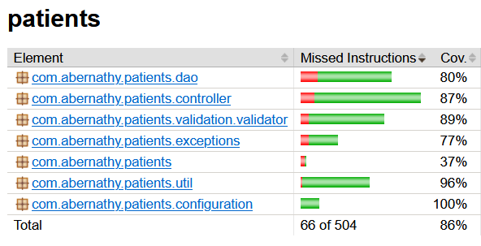
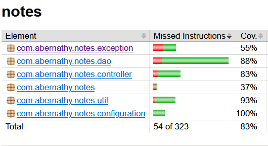
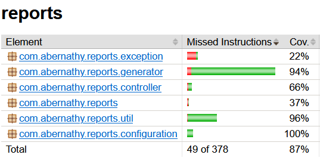
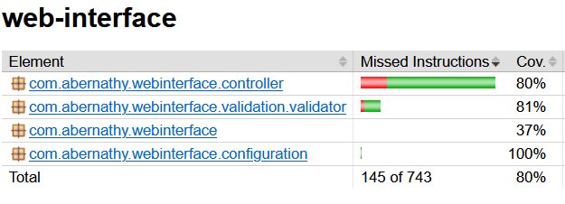

# Diabetes Risk Screening application
The Diabetes Risk Screening is an application developed for Abernathy Clinic, USA.  
The application is made of 4 microservices :
- **Patients microservice** : Allow creation, update, and deletion of patient medical record
- **Notes microservice** : Allow practitioners to add notes to patients medical records history.
- **Reports microservice** : Generate a report based on the patient information and the notes that practitioners wrote.
- **Web Interface** : UI to handle every operations, from creating a patient to report generation.

Each microservices have their own API specifications, which can be found in the `README.md` of their respective folders. Also, you will find setup instructions.

# Tests and code coverage
The application has **78 tests** that cover various use cases. The code coverage for the whole application is **84%**. Below, you will find a detailed report of these metrics.

## Patients microservice
**The patients microservice contains 19 tests.** Full report can be found here : [Surefire Patients report](documentation/patients-surefire.png)

## Notes microservice
**The notes microservice contains 19 tests.** Full report can be found here : [Surefire Notes report](documentation/notes-surefire.png)
 

## Reports microservice
**The reports microservice contains 13 tests.** Full report can be found here : [Surefire Reports report](documentation/reports-surefire.png)

## Web interface
**The web interface contains 27 tests.** Full report can be found here : [Surefire WebInterface report](documentation/webinterface-surefire.png)
