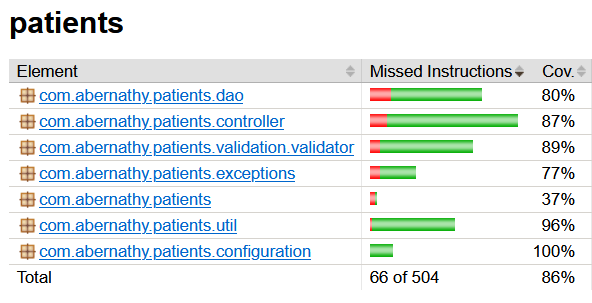
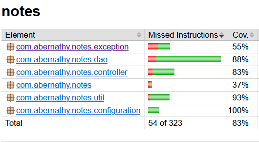
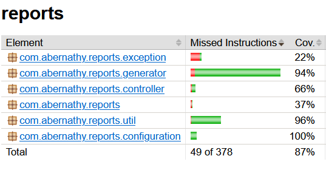

# Diabetes Risk Screening application
The Diabetes Risk Screening is an application developed for Abernathy Clinic, USA. <br>
The application is made of 4 microservices :
- **Patients microservice** : Allow creation, update, and deletion of patient medical record
- **Notes microservice** : Allow practitioners to add notes to patients medical records history.
- **Reports microservice** : Generate a report based on the patient information and the notes that practitioners wrote.
- **Web Interface** : UI to handle every operations, from creating a patient to report generation.

Each microservices have their own API specifications, which can be found in the `README.md` of their respective folders. Also, you will find setup instructions.

# [](https://https://docker.com/) Running the application with Docker
The application can be easily imported and created with **docker-compose**, please follow the steps carefully : 
1. **In the root directory**, there is a `docker-compose.yml` file. It contains images of micro-services and databases. To run the compose file, type in your terminal :
    
    ```shell
    > docker compose up -d
    ```
2. When every images are pulled, you have to create the `patients` table in the MySQL service 

    ```shell
    > docker compose exec mysql /bin/bash/
    ```
    then

    ```shell
    > mysql -u root -proot
    > use abernathyclinic;
    ```

    **Now you should be connected to the MySQL service**. Paste the following SQL file into your terminal : 
    ```sql
    DROP TABLE IF EXISTS `patients`;
    CREATE TABLE `patients` (
        id varchar(100) NOT NULL,
        first_name varchar(100) NOT NULL,
        last_name varchar(100) NOT NULL,
        date_of_birth date DEFAULT NULL,
        gender char(1) DEFAULT NULL,
        address varchar(255) DEFAULT NULL,
        phone varchar(150) DEFAULT NULL,
        PRIMARY KEY (id)
    ) ENGINE=InnoDB AUTO_INCREMENT=0 DEFAULT CHARSET=utf8mb4 COLLATE=utf8mb4_0900_ai_ci;
    ```

    Check if the table has been created using : 
    ```shell
    > SHOW TABLES;
    ```

    If the creation is successful, you should see the `patients` table in the resulting output.
    The application should be running on **[http://localhost:8080](http://localhost:8080)**.

<br> **A Postman collection can be found in the root directory, to test every endpoints** API Documentation is available in the `documentation` folder.

# Tests and code coverage
The application has **78 tests** that cover various use cases. The code coverage for the whole application is **84%**. Below, there is a detailed report of these metrics.

## Patients microservice
**The patients microservice contains 19 tests.** Full report can be found here : [Surefire Patients report](documentation/images/patients-surefire.png)


## Notes microservice
**The notes microservice contains 19 tests.** Full report can be found here : [Surefire Notes report](documentation/images/notes-surefire.png)
<br>


## Reports microservice
**The reports microservice contains 13 tests.** Full report can be found here : [Surefire Reports report](documentation/images/reports-surefire.png)


## Web interface
**The web interface contains 27 tests.** Full report can be found here : [Surefire WebInterface report](documentation/images/webinterface-surefire.png)
